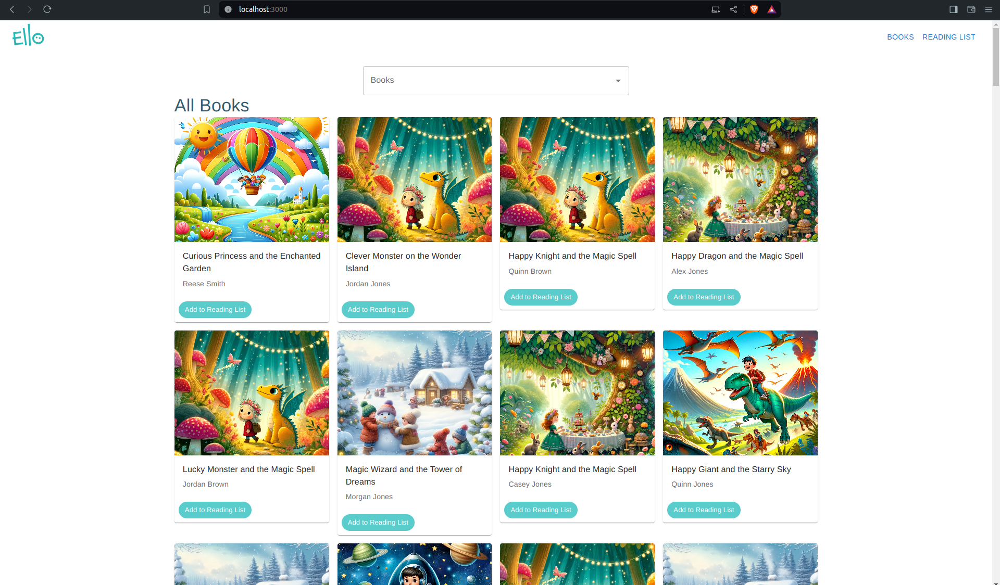
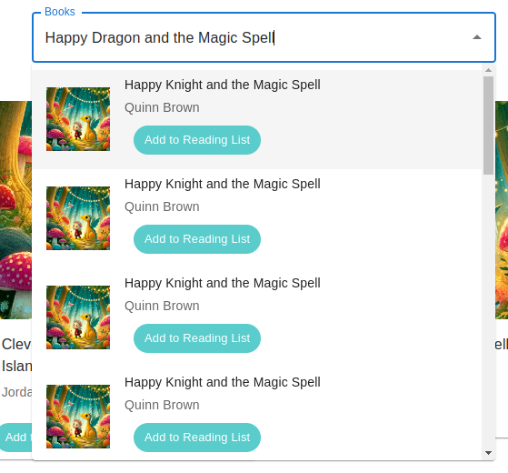
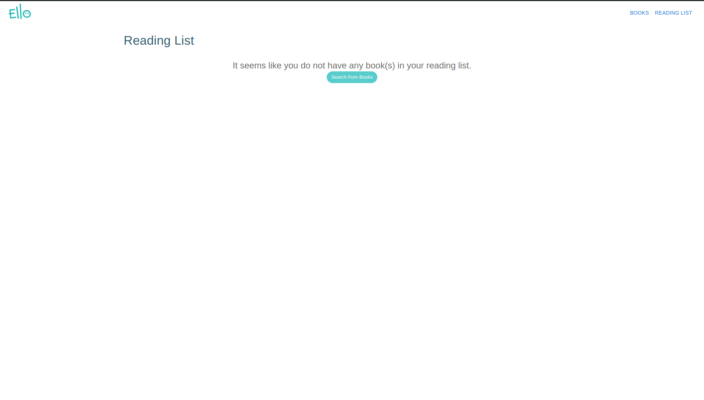
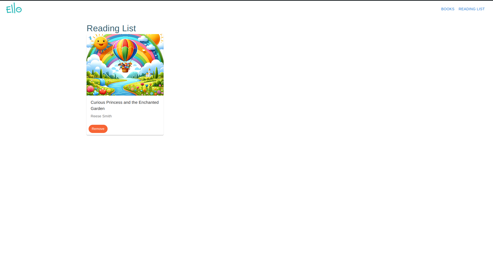

 

# Ello Engineering Challenge

## Configuration
Add the following property to .env \
`REACT_APP_GraphQl_Uri = 'http://localhost:4000/'`\
It defaults to 'http://localhost:4000/' if it is null.

## Running the App

In the project directory, run:

### `npm start`

Open [http://localhost:3000](http://localhost:3000) to view it in the browser.

# Screenshots
## 1. List of Books

## 2. Searching for a Book

## 3. Reading List
### Empty Reading List

### Reading List With Books

